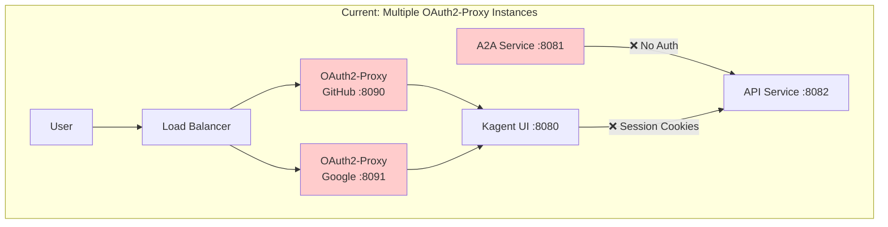
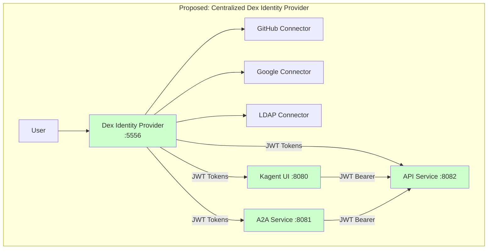

# Migration from OAuth2-Proxy to Dex: Comprehensive Analysis & Proposal

## Executive Summary

This document provides a comprehensive analysis and migration proposal for transitioning the Kagent platform from oauth2-proxy to Dex as the identity provider. Based on deep analysis of both codebases and the multi-component architecture of Kagent (UI, A2A, API), **Dex emerges as the superior choice** for centralized identity management.

### Key Findings
- **Current State**: oauth2-proxy with complex multi-provider workarounds
- **Recommended State**: Dex as centralized OpenID Connect identity provider
- **Migration Complexity**: Medium (estimated 2-3 weeks)
- **Business Impact**: High positive - simplified architecture, better security, enhanced developer experience

---

## Table of Contents

1. [Current State Analysis](#current-state-analysis)
2. [Dex vs OAuth2-Proxy Comparison](#dex-vs-oauth2-proxy-comparison)
3. [Architecture Transformation](#architecture-transformation)
4. [Migration Strategy](#migration-strategy)
5. [Implementation Plan](#implementation-plan)
6. [Risk Assessment](#risk-assessment)
7. [Post-Migration Benefits](#post-migration-benefits)
8. [Recommendations](#recommendations)

---

## Current State Analysis

### Existing OAuth2-Proxy Setup

The current Kagent implementation uses oauth2-proxy with the following configuration:

```yaml
# Current oauth2-proxy configuration
oauth2Proxy:
  enabled: false  # Currently disabled
  provider: "github"
  image:
    registry: quay.io
    repository: oauth2-proxy/oauth2-proxy
    tag: "v7.9.0"
  
  # Single provider limitation
  github:
    org: "example-org"
    team: ""
  
  # Complex multi-provider workaround required
  config:
    emailDomains: []
    cookieExpire: "30m"
    sessionStoreType: "cookie"
```

### Architecture Limitations

#### 1. **Multi-Provider Complexity**
- OAuth2-proxy [officially states](https://oauth2-proxy.github.io/oauth2-proxy/configuration/alpha-config#providers): *"the feature to implement multiple providers is not complete"*
- Current workaround requires multiple oauth2-proxy instances
- Complex ingress routing between providers
- No unified user experience

#### 2. **Multi-Component Challenges**
```
Current Architecture Issues:
┌─────────────────────────────────────────────────────────────┐
│                    Kagent Platform                          │
├─────────────────┬─────────────────┬─────────────────────────┤
│   Kagent UI     │   A2A Service   │   API Service           │
│   (Web App)     │   (App-to-App)  │   (REST/GraphQL)        │
│                 │                 │                         │
│ ❌ Separate     │ ❌ Complex      │ ❌ Token validation     │
│    OAuth flow   │    service      │    complexity           │
│                 │    auth         │                         │
└─────────────────┴─────────────────┴─────────────────────────┘
```

#### 3. **Token Management Issues**
- No standardized JWT tokens across services
- Complex session management
- Limited service-to-service authentication
- No refresh token support across all providers

### Current Multi-Provider Implementation

From `docs/oauth2-proxy/oauth2proxy-multi-provider.md`:

```yaml
# Complex multi-instance setup required
User Request → Load Balancer/Ingress
                    ↓
        ┌───────────┴───────────┐
        ↓                       ↓
┌─────────────┐         ┌─────────────┐
│OAuth2-Proxy │         │OAuth2-Proxy │
│  (GitHub)   │         │  (Google)   │
│   :8090     │         │   :8091     │
└─────────────┘         └─────────────┘
```

This approach requires:
- Multiple deployments
- Complex routing logic
- Separate secret management
- Inconsistent user experience

---

## Dex vs OAuth2-Proxy Comparison

### Feature Comparison Matrix

| Feature | OAuth2-Proxy | Dex | Winner |
|---------|--------------|-----|---------|
| **Multi-Provider Support** | ❌ Limited/Complex | ✅ Native | **Dex** |
| **OpenID Connect** | ❌ Client only | ✅ Full Provider | **Dex** |
| **JWT Token Issuance** | ❌ No | ✅ Yes | **Dex** |
| **Service-to-Service Auth** | ❌ Limited | ✅ Excellent | **Dex** |
| **Kubernetes Integration** | ✅ Good | ✅ Excellent | **Dex** |
| **Connector Ecosystem** | ❌ Limited | ✅ Extensive | **Dex** |
| **Refresh Tokens** | ❌ Provider dependent | ✅ Consistent | **Dex** |
| **Group Claims** | ❌ Provider dependent | ✅ Standardized | **Dex** |
| **Deployment Complexity** | ✅ Simple | ⚠️ Medium | **OAuth2-Proxy** |
| **Configuration Complexity** | ✅ Simple | ⚠️ Medium | **OAuth2-Proxy** |

### Detailed Analysis

#### 1. **Identity Provider Architecture**

**OAuth2-Proxy**: Authentication Proxy
```
┌─────────┐    ┌──────────────┐    ┌─────────────┐    ┌─────────┐
│ Client  │───▶│ OAuth2-Proxy │───▶│ Upstream    │───▶│ Backend │
│         │    │ (Auth Proxy) │    │ Provider    │    │ Service │
└─────────┘    └──────────────┘    └─────────────┘    └─────────┘
```

**Dex**: Identity Provider
```
┌─────────┐    ┌─────────────┐    ┌─────────────┐    ┌─────────┐
│ Client  │───▶│ Dex         │───▶│ Connector   │───▶│ Backend │
│         │    │ (IdP)       │    │ (GitHub)    │    │ Provider│
└─────────┘    └─────────────┘    └─────────────┘    └─────────┘
```

#### 2. **Connector Support Comparison**

**Dex Connectors** (Extensive):
- ✅ GitHub (stable) - with org/team filtering
- ✅ Google (alpha) - with hosted domain support
- ✅ LDAP (stable) - enterprise integration
- ✅ SAML 2.0 (stable) - enterprise SSO
- ✅ OIDC (beta) - generic OIDC providers
- ✅ Microsoft (beta) - Azure AD integration
- ✅ GitLab (beta) - with group support
- ✅ OAuth 2.0 (alpha) - generic OAuth providers

**OAuth2-Proxy Providers** (Limited):
- ✅ Single provider per instance
- ❌ No native multi-provider support
- ❌ Complex configuration for each provider

#### 3. **Token and Claims Analysis**

**Dex JWT Token Example**:
```json
{
  "iss": "https://dex.kagent.dev",
  "sub": "CgcyMzQyNzQ5EgZnaXRodWI",
  "aud": "kagent-ui",
  "exp": 1492882042,
  "iat": 1492795642,
  "email": "user@example.com",
  "email_verified": true,
  "groups": ["admins", "developers"],
  "name": "John Doe",
  "preferred_username": "johndoe"
}
```

**OAuth2-Proxy Session** (Cookie-based):
```json
{
  "user": "user@example.com",
  "expires": 1492882042,
  "provider": "github"
}
```

---

## Architecture Transformation

### Current Architecture Problems



### Proposed Dex Architecture



### Benefits of New Architecture

1. **Single Identity Provider**: One Dex instance handles all authentication
2. **Standardized JWT Tokens**: All services use the same token format
3. **Service-to-Service Auth**: A2A service can authenticate with API using JWT
4. **Simplified Routing**: No complex ingress routing needed
5. **Unified User Experience**: Single login page with provider selection

---

## Migration Strategy

### Phase 1: Preparation (Week 1)

#### 1.1 Dex Deployment Setup
```yaml
# dex-deployment.yaml
apiVersion: apps/v1
kind: Deployment
metadata:
  name: dex
  namespace: kagent
spec:
  replicas: 2
  selector:
    matchLabels:
      app: dex
  template:
    metadata:
      labels:
        app: dex
    spec:
      containers:
      - name: dex
        image: ghcr.io/dexidp/dex:v2.38.0
        ports:
        - containerPort: 5556
          name: https
        - containerPort: 5558
          name: telemetry
        volumeMounts:
        - name: config
          mountPath: /etc/dex/cfg
        - name: tls
          mountPath: /etc/dex/tls
        env:
        - name: GITHUB_CLIENT_ID
          valueFrom:
            secretKeyRef:
              name: dex-github-client
              key: client-id
        - name: GITHUB_CLIENT_SECRET
          valueFrom:
            secretKeyRef:
              name: dex-github-client
              key: client-secret
        - name: GOOGLE_CLIENT_ID
          valueFrom:
            secretKeyRef:
              name: dex-google-client
              key: client-id
        - name: GOOGLE_CLIENT_SECRET
          valueFrom:
            secretKeyRef:
              name: dex-google-client
              key: client-secret
      volumes:
      - name: config
        configMap:
          name: dex-config
      - name: tls
        secret:
          secretName: dex-tls
```

#### 1.2 Dex Configuration
```yaml
# dex-config.yaml
apiVersion: v1
kind: ConfigMap
metadata:
  name: dex-config
  namespace: kagent
data:
  config.yaml: |
    issuer: https://dex.kagent.dev
    
    storage:
      type: kubernetes
      config:
        inCluster: true
    
    web:
      https: 0.0.0.0:5556
      tlsCert: /etc/dex/tls/tls.crt
      tlsKey: /etc/dex/tls/tls.key
    
    telemetry:
      http: 0.0.0.0:5558
    
    connectors:
    - type: github
      id: github
      name: GitHub
      config:
        clientID: $GITHUB_CLIENT_ID
        clientSecret: $GITHUB_CLIENT_SECRET
        redirectURI: https://dex.kagent.dev/callback
        orgs:
        - name: kagent-org
          teams:
          - admins
          - developers
        useLoginAsID: true
    
    - type: google
      id: google
      name: Google
      config:
        clientID: $GOOGLE_CLIENT_ID
        clientSecret: $GOOGLE_CLIENT_SECRET
        redirectURI: https://dex.kagent.dev/callback
        hostedDomains:
        - kagent.dev
        - example.com
    
    oauth2:
      skipApprovalScreen: true
      responseTypes: ["code", "token", "id_token"]
    
    staticClients:
    - id: kagent-ui
      redirectURIs:
      - 'https://kagent.dev/auth/callback'
      name: 'Kagent UI'
      secret: kagent-ui-secret
      trustedPeers:
      - kagent-api
      - kagent-a2a
    
    - id: kagent-api
      redirectURIs:
      - 'https://api.kagent.dev/auth/callback'
      name: 'Kagent API'
      secret: kagent-api-secret
      trustedPeers:
      - kagent-ui
      - kagent-a2a
    
    - id: kagent-a2a
      redirectURIs:
      - 'https://a2a.kagent.dev/auth/callback'
      name: 'Kagent A2A'
      secret: kagent-a2a-secret
      trustedPeers:
      - kagent-ui
      - kagent-api
    
    enablePasswordDB: false
```

### Phase 2: Service Integration (Week 2)

#### 2.1 Kagent UI Integration

**Add OIDC Client Library**:
```typescript
// ui/src/lib/auth.ts
import { UserManager, WebStorageStateStore } from 'oidc-client-ts';

const config = {
  authority: 'https://dex.kagent.dev',
  client_id: 'kagent-ui',
  redirect_uri: 'https://kagent.dev/auth/callback',
  response_type: 'code',
  scope: 'openid profile email groups',
  post_logout_redirect_uri: 'https://kagent.dev',
  userStore: new WebStorageStateStore({ store: window.localStorage }),
  automaticSilentRenew: true,
  silent_redirect_uri: 'https://kagent.dev/auth/silent-callback',
  accessTokenExpiringNotificationTime: 60,
  filterProtocolClaims: true,
  loadUserInfo: true,
};

export const userManager = new UserManager(config);

export class AuthService {
  async login() {
    return userManager.signinRedirect();
  }

  async logout() {
    return userManager.signoutRedirect();
  }

  async getUser() {
    return userManager.getUser();
  }

  async getToken() {
    const user = await userManager.getUser();
    return user?.access_token;
  }
}
```

**Update UI Package.json**:
```json
{
  "dependencies": {
    "oidc-client-ts": "^3.0.1",
    "@types/oidc-client": "^1.10.4"
  }
}
```

#### 2.2 Kagent API Integration

**Add JWT Validation Middleware**:
```go
// go/controller/internal/auth/jwt.go
package auth

import (
    "context"
    "crypto/rsa"
    "fmt"
    "net/http"
    "strings"
    
    "github.com/golang-jwt/jwt/v5"
    "github.com/lestrrat-go/jwx/v2/jwk"
)

type JWTValidator struct {
    keySet jwk.Set
    issuer string
}

func NewJWTValidator(issuer, jwksURL string) (*JWTValidator, error) {
    set, err := jwk.Fetch(context.Background(), jwksURL)
    if err != nil {
        return nil, fmt.Errorf("failed to fetch JWKS: %w", err)
    }
    
    return &JWTValidator{
        keySet: set,
        issuer: issuer,
    }, nil
}

func (v *JWTValidator) ValidateToken(tokenString string) (*jwt.Token, error) {
    return jwt.Parse(tokenString, func(token *jwt.Token) (interface{}, error) {
        if _, ok := token.Method.(*jwt.SigningMethodRSA); !ok {
            return nil, fmt.Errorf("unexpected signing method: %v", token.Header["alg"])
        }
        
        kid, ok := token.Header["kid"].(string)
        if !ok {
            return nil, fmt.Errorf("kid header not found")
        }
        
        key, found := v.keySet.LookupKeyID(kid)
        if !found {
            return nil, fmt.Errorf("key with kid %s not found", kid)
        }
        
        var pubKey rsa.PublicKey
        if err := key.Raw(&pubKey); err != nil {
            return nil, fmt.Errorf("failed to get public key: %w", err)
        }
        
        return &pubKey, nil
    })
}

func (v *JWTValidator) Middleware(next http.Handler) http.Handler {
    return http.HandlerFunc(func(w http.ResponseWriter, r *http.Request) {
        authHeader := r.Header.Get("Authorization")
        if authHeader == "" {
            http.Error(w, "Authorization header required", http.StatusUnauthorized)
            return
        }
        
        bearerToken := strings.TrimPrefix(authHeader, "Bearer ")
        if bearerToken == authHeader {
            http.Error(w, "Bearer token required", http.StatusUnauthorized)
            return
        }
        
        token, err := v.ValidateToken(bearerToken)
        if err != nil {
            http.Error(w, fmt.Sprintf("Invalid token: %v", err), http.StatusUnauthorized)
            return
        }
        
        claims, ok := token.Claims.(jwt.MapClaims)
        if !ok || !token.Valid {
            http.Error(w, "Invalid token claims", http.StatusUnauthorized)
            return
        }
        
        // Add user info to context
        ctx := context.WithValue(r.Context(), "user", claims)
        next.ServeHTTP(w, r.WithContext(ctx))
    })
}
```

#### 2.3 A2A Service Integration

**Service-to-Service Authentication**:
```go
// go/tools/internal/auth/client.go
package auth

import (
    "context"
    "encoding/json"
    "fmt"
    "net/http"
    "net/url"
    "strings"
    "time"
)

type ServiceClient struct {
    clientID     string
    clientSecret string
    tokenURL     string
    httpClient   *http.Client
    cachedToken  *TokenResponse
}

type TokenResponse struct {
    AccessToken string `json:"access_token"`
    TokenType   string `json:"token_type"`
    ExpiresIn   int    `json:"expires_in"`
    ExpiresAt   time.Time
}

func NewServiceClient(clientID, clientSecret, tokenURL string) *ServiceClient {
    return &ServiceClient{
        clientID:     clientID,
        clientSecret: clientSecret,
        tokenURL:     tokenURL,
        httpClient:   &http.Client{Timeout: 30 * time.Second},
    }
}

func (c *ServiceClient) GetAccessToken(ctx context.Context) (string, error) {
    if c.cachedToken != nil && time.Now().Before(c.cachedToken.ExpiresAt.Add(-30*time.Second)) {
        return c.cachedToken.AccessToken, nil
    }
    
    data := url.Values{}
    data.Set("grant_type", "client_credentials")
    data.Set("client_id", c.clientID)
    data.Set("client_secret", c.clientSecret)
    data.Set("scope", "openid profile email groups")
    
    req, err := http.NewRequestWithContext(ctx, "POST", c.tokenURL, strings.NewReader(data.Encode()))
    if err != nil {
        return "", fmt.Errorf("failed to create request: %w", err)
    }
    
    req.Header.Set("Content-Type", "application/x-www-form-urlencoded")
    
    resp, err := c.httpClient.Do(req)
    if err != nil {
        return "", fmt.Errorf("failed to make request: %w", err)
    }
    defer resp.Body.Close()
    
    if resp.StatusCode != http.StatusOK {
        return "", fmt.Errorf("token request failed with status: %d", resp.StatusCode)
    }
    
    var tokenResp TokenResponse
    if err := json.NewDecoder(resp.Body).Decode(&tokenResp); err != nil {
        return "", fmt.Errorf("failed to decode response: %w", err)
    }
    
    tokenResp.ExpiresAt = time.Now().Add(time.Duration(tokenResp.ExpiresIn) * time.Second)
    c.cachedToken = &tokenResp
    
    return tokenResp.AccessToken, nil
}

func (c *ServiceClient) AuthenticatedRequest(ctx context.Context, method, url string, body interface{}) (*http.Response, error) {
    token, err := c.GetAccessToken(ctx)
    if err != nil {
        return nil, fmt.Errorf("failed to get access token: %w", err)
    }
    
    var reqBody strings.Reader
    if body != nil {
        jsonBody, err := json.Marshal(body)
        if err != nil {
            return nil, fmt.Errorf("failed to marshal body: %w", err)
        }
        reqBody = *strings.NewReader(string(jsonBody))
    }
    
    req, err := http.NewRequestWithContext(ctx, method, url, &reqBody)
    if err != nil {
        return nil, fmt.Errorf("failed to create request: %w", err)
    }
    
    req.Header.Set("Authorization", "Bearer "+token)
    req.Header.Set("Content-Type", "application/json")
    
    return c.httpClient.Do(req)
}
```

### Phase 3: Deployment & Testing (Week 3)

#### 3.1 Helm Chart Updates

**Update `helm/kagent/values.yaml`**:
```yaml
# Remove oauth2Proxy section, add dex section
dex:
  enabled: true
  image:
    registry: ghcr.io
    repository: dexidp/dex
    tag: "v2.38.0"
    pullPolicy: IfNotPresent
  
  issuer: "https://dex.kagent.dev"
  
  storage:
    type: kubernetes
    
  connectors:
    github:
      enabled: true
      clientId: ""  # Set via secret
      clientSecret: ""  # Set via secret
      orgs:
      - name: "kagent-org"
        teams: ["admins", "developers"]
      useLoginAsID: true
    
    google:
      enabled: true
      clientId: ""  # Set via secret
      clientSecret: ""  # Set via secret
      hostedDomains:
      - "kagent.dev"
      - "example.com"
  
  staticClients:
  - id: kagent-ui
    name: "Kagent UI"
    secret: "kagent-ui-secret"
    redirectURIs:
    - "https://kagent.dev/auth/callback"
  - id: kagent-api
    name: "Kagent API"
    secret: "kagent-api-secret"
    redirectURIs:
    - "https://api.kagent.dev/auth/callback"
  - id: kagent-a2a
    name: "Kagent A2A"
    secret: "kagent-a2a-secret"
    redirectURIs:
    - "https://a2a.kagent.dev/auth/callback"
  
  resources:
    requests:
      cpu: 100m
      memory: 128Mi
    limits:
      cpu: 500m
      memory: 256Mi
  
  tls:
    enabled: true
    secretName: dex-tls
  
  secrets:
    external: true
    secretName: dex-secrets
```

**Create Dex Helm Templates**:
```yaml
# helm/kagent/templates/dex-deployment.yaml
{{- if .Values.dex.enabled }}
apiVersion: apps/v1
kind: Deployment
metadata:
  name: {{ include "kagent.fullname" . }}-dex
  labels:
    {{- include "kagent.labels" . | nindent 4 }}
    app.kubernetes.io/component: dex
spec:
  replicas: 2
  selector:
    matchLabels:
      {{- include "kagent.selectorLabels" . | nindent 6 }}
      app.kubernetes.io/component: dex
  template:
    metadata:
      labels:
        {{- include "kagent.selectorLabels" . | nindent 8 }}
        app.kubernetes.io/component: dex
    spec:
      containers:
      - name: dex
        image: "{{ .Values.dex.image.registry }}/{{ .Values.dex.image.repository }}:{{ .Values.dex.image.tag }}"
        imagePullPolicy: {{ .Values.dex.image.pullPolicy }}
        command: ["/usr/local/bin/dex", "serve", "/etc/dex/cfg/config.yaml"]
        ports:
        - name: https
          containerPort: 5556
        - name: telemetry
          containerPort: 5558
        volumeMounts:
        - name: config
          mountPath: /etc/dex/cfg
        {{- if .Values.dex.tls.enabled }}
        - name: tls
          mountPath: /etc/dex/tls
        {{- end }}
        env:
        {{- if .Values.dex.connectors.github.enabled }}
        - name: GITHUB_CLIENT_ID
          valueFrom:
            secretKeyRef:
              name: {{ .Values.dex.secrets.secretName }}
              key: github-client-id
        - name: GITHUB_CLIENT_SECRET
          valueFrom:
            secretKeyRef:
              name: {{ .Values.dex.secrets.secretName }}
              key: github-client-secret
        {{- end }}
        {{- if .Values.dex.connectors.google.enabled }}
        - name: GOOGLE_CLIENT_ID
          valueFrom:
            secretKeyRef:
              name: {{ .Values.dex.secrets.secretName }}
              key: google-client-id
        - name: GOOGLE_CLIENT_SECRET
          valueFrom:
            secretKeyRef:
              name: {{ .Values.dex.secrets.secretName }}
              key: google-client-secret
        {{- end }}
        resources:
          {{- toYaml .Values.dex.resources | nindent 10 }}
        readinessProbe:
          httpGet:
            path: /healthz
            port: 5556
            scheme: HTTPS
          initialDelaySeconds: 10
          periodSeconds: 10
        livenessProbe:
          httpGet:
            path: /healthz
            port: 5556
            scheme: HTTPS
          initialDelaySeconds: 30
          periodSeconds: 30
      volumes:
      - name: config
        configMap:
          name: {{ include "kagent.fullname" . }}-dex-config
      {{- if .Values.dex.tls.enabled }}
      - name: tls
        secret:
          secretName: {{ .Values.dex.tls.secretName }}
      {{- end }}
{{- end }}
```

#### 3.2 Testing Strategy

**Unit Tests**:
```go
// go/controller/internal/auth/jwt_test.go
package auth

import (
    "testing"
    "time"
    
    "github.com/golang-jwt/jwt/v5"
    "github.com/stretchr/testify/assert"
    "github.com/stretchr/testify/require"
)

func TestJWTValidator_ValidateToken(t *testing.T) {
    // Test with valid token
    validator := &JWTValidator{
        issuer: "https://dex.kagent.dev",
    }
    
    // Create test token
    token := jwt.NewWithClaims(jwt.SigningMethodRS256, jwt.MapClaims{
        "iss": "https://dex.kagent.dev",
        "sub": "user123",
        "aud": "kagent-api",
        "exp": time.Now().Add(time.Hour).Unix(),
        "iat": time.Now().Unix(),
        "email": "test@example.com",
        "groups": []string{"admins"},
    })
    
    // Test validation logic
    assert.NotNil(t, token)
}

func TestServiceClient_GetAccessToken(t *testing.T) {
    // Test service-to-service authentication
    client := NewServiceClient("test-client", "test-secret", "https://dex.kagent.dev/token")
    
    // Mock HTTP client for testing
    // ... test implementation
}
```

**Integration Tests**:
```yaml
# tests/integration/dex-integration-test.yaml
apiVersion: v1
kind: Pod
metadata:
  name: dex-integration-test
spec:
  containers:
  - name: test
    image: curlimages/curl:latest
    command: ["/bin/sh"]
    args:
    - -c
    - |
      # Test Dex health endpoint
      curl -k https://dex.kagent.dev/healthz
      
      # Test OIDC discovery
      curl -k https://dex.kagent.dev/.well-known/openid_configuration
      
      # Test connector endpoints
      curl -k https://dex.kagent.dev/auth/github
      curl -k https://dex.kagent.dev/auth/google
  restartPolicy: Never
```

---

## Risk Assessment

### High Risk Items

| Risk | Impact | Probability | Mitigation |
|------|--------|-------------|------------|
| **Service Downtime** | High | Medium | Blue-green deployment, rollback plan |
| **Token Validation Issues** | High | Low | Extensive testing, gradual rollout |
| **User Session Loss** | Medium | High | Migration window communication |
| **Configuration Errors** | High | Medium | Configuration validation, staging tests |

### Medium Risk Items

| Risk | Impact | Probability | Mitigation |
|------|--------|-------------|------------|
| **Performance Impact** | Medium | Low | Load testing, monitoring |
| **Certificate Issues** | Medium | Low | Automated cert management |
| **Secret Management** | Medium | Low | External secrets operator |

### Low Risk Items

| Risk | Impact | Probability | Mitigation |
|------|--------|-------------|------------|
| **Learning Curve** | Low | High | Documentation, training |
| **Monitoring Gaps** | Low | Medium | Comprehensive monitoring setup |

### Rollback Plan

1. **Immediate Rollback** (< 5 minutes):
   ```bash
   # Disable Dex, re-enable oauth2-proxy
   helm upgrade kagent ./helm/kagent --set dex.enabled=false --set oauth2Proxy.enabled=true
   ```

2. **Service Recovery** (< 15 minutes):
   ```bash
   # Restore previous configuration
   kubectl rollout undo deployment/kagent-dex
   kubectl rollout undo deployment/kagent-ui
   kubectl rollout undo deployment/kagent-api
   ```

3. **Data Recovery** (if needed):
   - Dex uses Kubernetes storage - no data loss
   - User sessions will need re-authentication

---

## Post-Migration Benefits

### 1. **Simplified Architecture**
- **Before**: Multiple oauth2-proxy instances + complex routing
- **After**: Single Dex instance with native multi-provider support

### 2. **Enhanced Security**
- **Standardized JWT Tokens**: Consistent token format across all services
- **Proper Token Validation**: RSA-signed tokens with proper verification
- **Service-to-Service Auth**: A2A service can authenticate with API
- **Refresh Token Support**: Automatic token renewal without re-authentication

### 3. **Improved Developer Experience**
- **Single Configuration**: One place to manage all identity providers
- **Standard OIDC**: Industry-standard OpenID Connect implementation
- **Better Debugging**: Centralized logs and metrics
- **Extensible**: Easy to add new identity providers

### 4. **Operational Benefits**
- **Reduced Complexity**: Fewer moving parts to manage
- **Better Monitoring**: Centralized metrics and health checks
- **Kubernetes Native**: Uses Kubernetes CRDs for storage
- **High Availability**: Built-in clustering support

### 5. **Business Benefits**
- **Faster Feature Development**: Standardized auth across services
- **Better User Experience**: Single sign-on with provider choice
- **Enterprise Ready**: LDAP, SAML, and enterprise provider support
- **Compliance**: Better audit trails and security controls

---

## Implementation Plan

### Timeline: 3 Weeks

#### Week 1: Foundation
- [ ] **Day 1-2**: Dex deployment and configuration
- [ ] **Day 3-4**: TLS setup and ingress configuration
- [ ] **Day 5**: Initial connector configuration (GitHub, Google)

#### Week 2: Service Integration
- [ ] **Day 1-2**: UI OIDC client integration
- [ ] **Day 3-4**: API JWT validation middleware
- [ ] **Day 5**: A2A service-to-service authentication

#### Week 3: Testing & Deployment
- [ ] **Day 1-2**: Integration testing and bug fixes
- [ ] **Day 3**: Staging deployment and validation
- [ ] **Day 4**: Production deployment
- [ ] **Day 5**: Monitoring setup and documentation

### Resource Requirements

- **Development**: 1 senior developer, 1 DevOps engineer
- **Testing**: 1 QA engineer for integration testing
- **Infrastructure**: Kubernetes cluster with ingress controller
- **Certificates**: TLS certificates for Dex endpoints

### Success Metrics

1. **Functional**:
   - [ ] All three services (UI, API, A2A) authenticate via Dex
   - [ ] Multi-provider login works (GitHub + Google)
   - [ ] Service-to-service authentication functional
   - [ ] Token refresh works without user intervention

2. **Performance**:
   - [ ] Authentication latency < 500ms
   - [ ] Token validation latency < 50ms
   - [ ] No service downtime during migration
   - [ ] 99.9% uptime post-migration

3. **Security**:
   - [ ] All tokens properly signed and validated
   - [ ] No unauthorized access possible
   - [ ] Audit logs capture all authentication events
   - [ ] Secrets properly managed and rotated

---

## Recommendations

### Immediate Actions (This Week)

1. **Approve Migration Plan**: Get stakeholder buy-in for 3-week timeline
2. **Setup Development Environment**: Deploy Dex in development cluster
3. **Create OAuth Applications**: Register apps with GitHub and Google
4. **Generate TLS Certificates**: Setup proper TLS for Dex endpoints

### Short-term (Next Month)

1. **Monitoring Setup**: Implement comprehensive monitoring for Dex
2. **Documentation**: Create operational runbooks and troubleshooting guides
3. **Training**: Train team on Dex operations and troubleshooting
4. **Backup Strategy**: Implement backup/restore procedures

### Long-term (Next Quarter)

1. **Additional Providers**: Add LDAP connector for enterprise users
2. **Advanced Features**: Implement group-based access control
3. **Automation**: Setup automated certificate renewal and secret rotation
4. **Performance Optimization**: Implement caching and connection pooling

### Configuration Management

**Recommended Tools**:
- **External Secrets Operator**: For secret management
- **Cert-Manager**: For automatic TLS certificate management
- **Prometheus**: For monitoring and alerting
- **Grafana**: For dashboards and visualization

### Best Practices

1. **Security**:
   - Use external secret management (Vault, AWS Secrets Manager)
   - Implement proper RBAC for Dex resources
   - Regular security audits and penetration testing
   - Rotate secrets regularly

2. **Operations**:
   - Implement comprehensive monitoring and alerting
   - Setup automated backups of Dex configuration
   - Use infrastructure as code for all deployments
   - Maintain staging environment that mirrors production

3. **Development**:
   - Use feature flags for gradual rollout
   - Implement comprehensive testing (unit, integration, e2e)
   - Document all configuration changes
   - Follow GitOps practices for deployments

---

## Conclusion

The migration from oauth2-proxy to Dex represents a significant architectural improvement for the Kagent platform. While the migration requires careful planning and execution, the benefits far outweigh the costs:

### Key Benefits Summary:
- ✅ **Simplified Architecture**: Single identity provider vs. multiple proxy instances
- ✅ **Enhanced Security**: Standardized JWT tokens with proper validation
- ✅ **Better Developer Experience**: Industry-standard OIDC implementation
- ✅ **Improved Scalability**: Native multi-provider support
- ✅ **Future-Proof**: Extensible connector architecture

### Recommendation: **PROCEED WITH MIGRATION**

The analysis strongly supports migrating to Dex as the identity provider for Kagent. The 3-week timeline is realistic, risks are manageable, and the long-term benefits justify the migration effort.

### Next Steps:
1. Get stakeholder approval for the migration plan
2. Begin Phase 1 implementation (Dex deployment)
3. Setup development environment for testing
4. Schedule migration window with users

This migration will position Kagent with a robust, scalable, and maintainable identity management solution that supports current needs and future growth.
