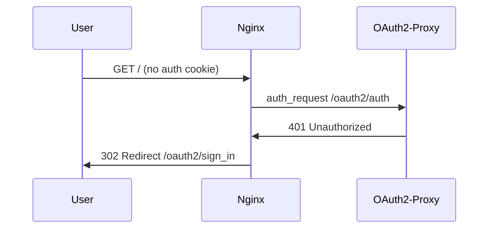
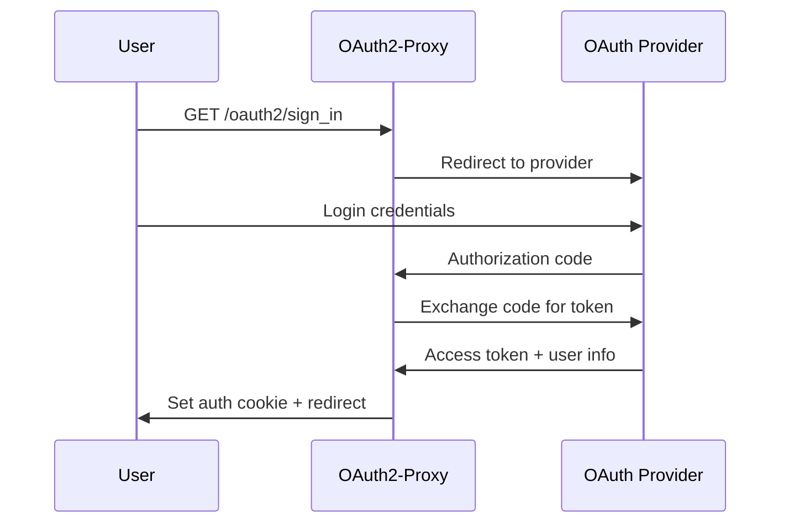
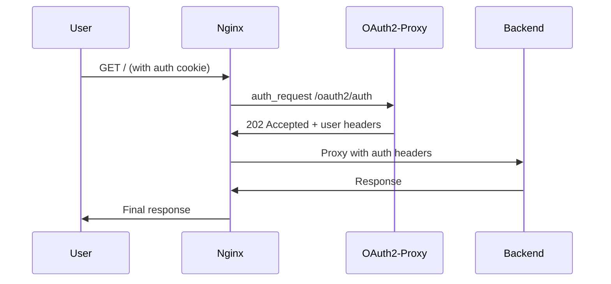

# OAuth2-Proxy Authentication Flow with Nginx

## Overview

This document details how nginx integrates with OAuth2-Proxy to provide authentication for the Kagent system, using nginx's `auth_request` module for seamless authentication enforcement.

## Authentication Architecture

### Components
- **Nginx**: Reverse proxy with auth_request module
- **OAuth2-Proxy**: Authentication service (port 4180)
- **OAuth Provider**: External identity provider (Google, GitHub, etc.)
- **Backend Services**: Protected application services

### Integration Pattern
```
User Request → Nginx → auth_request → OAuth2-Proxy → OAuth Provider
                ↓                           ↓
            Backend Service ←──── Authentication Success
```

## Detailed Authentication Flow

### 1. Unauthenticated Request


### 2. OAuth Authentication Process


### 3. Authenticated Request


## Nginx Configuration for Authentication

### OAuth2-Proxy Upstream
```nginx
upstream oauth2_proxy {
    server 127.0.0.1:4180;
}
```

### OAuth2 Location Blocks
```nginx
# OAuth2-Proxy endpoints
location /oauth2/ {
    proxy_pass http://oauth2_proxy;
    proxy_set_header Host $host;
    proxy_set_header X-Real-IP $remote_addr;
    proxy_set_header X-Forwarded-For $proxy_add_x_forwarded_for;
    proxy_set_header X-Forwarded-Proto $scheme;
    proxy_set_header X-Forwarded-Host $server_name;
}

# Authentication endpoint
location = /oauth2/auth {
    internal;
    proxy_pass http://oauth2_proxy;
    proxy_set_header Host $host;
    proxy_set_header X-Real-IP $remote_addr;
    proxy_set_header X-Forwarded-Uri $request_uri;
    proxy_set_header Content-Length "";
    proxy_pass_request_body off;
}
```

### Protected Location Blocks

#### Frontend Protection
```nginx
location / {
    auth_request /oauth2/auth;
    
    # Extract user information from auth response
    auth_request_set $user $upstream_http_x_auth_request_user;
    auth_request_set $email $upstream_http_x_auth_request_email;
    auth_request_set $preferred_username $upstream_http_x_auth_request_preferred_username;
    
    # Forward to Next.js with user context
    proxy_pass http://kagent_ui;
    proxy_set_header X-Auth-Request-User $user;
    proxy_set_header X-Auth-Request-Email $email;
    proxy_set_header X-Auth-Request-Preferred-Username $preferred_username;
    
    # Handle authentication failures
    error_page 401 = @error401;
}
```

#### API Protection
```nginx
location /api/ {
    auth_request /oauth2/auth;
    
    # Extract user information
    auth_request_set $user $upstream_http_x_auth_request_user;
    auth_request_set $email $upstream_http_x_auth_request_email;
    auth_request_set $preferred_username $upstream_http_x_auth_request_preferred_username;
    
    # Forward to API with user context
    proxy_pass http://kagent_backend/api/;
    proxy_set_header X-Auth-Request-User $user;
    proxy_set_header X-Auth-Request-Email $email;
    proxy_set_header X-Auth-Request-Preferred-Username $preferred_username;
    
    # Handle authentication failures
    error_page 401 = @error401;
}
```

#### WebSocket Protection
```nginx
location /api/ws/ {
    auth_request /oauth2/auth;
    
    # Extract user information
    auth_request_set $user $upstream_http_x_auth_request_user;
    auth_request_set $email $upstream_http_x_auth_request_email;
    auth_request_set $preferred_username $upstream_http_x_auth_request_preferred_username;
    
    # WebSocket proxy with authentication
    proxy_pass http://kagent_ws_backend/api/ws/;
    proxy_http_version 1.1;
    proxy_set_header Upgrade $http_upgrade;
    proxy_set_header Connection $connection_upgrade;
    proxy_set_header X-Auth-Request-User $user;
    proxy_set_header X-Auth-Request-Email $email;
    proxy_set_header X-Auth-Request-Preferred-Username $preferred_username;
    
    # WebSocket timeouts
    proxy_read_timeout 300s;
    proxy_send_timeout 300s;
    proxy_buffering off;
    
    # Handle authentication failures
    error_page 401 = @error401;
}
```

### Error Handling
```nginx
# Redirect unauthenticated users to sign-in
location @error401 {
    return 302 /oauth2/start?rd=$scheme://$host$request_uri;
}
```

## User Context Forwarding

### Headers Forwarded to Backend Services
```http
X-Auth-Request-User: user@example.com
X-Auth-Request-Email: user@example.com
X-Auth-Request-Preferred-Username: user
X-Real-IP: 192.168.1.100
X-Forwarded-For: 192.168.1.100
X-Forwarded-Proto: https
X-Forwarded-Host: kagent.example.com
```

### Backend Service Integration
Backend services can access user information through these headers:
```go
// Example Go code for extracting user context
func getUserFromHeaders(r *http.Request) *User {
    return &User{
        Email:    r.Header.Get("X-Auth-Request-Email"),
        Username: r.Header.Get("X-Auth-Request-User"),
        Name:     r.Header.Get("X-Auth-Request-Preferred-Username"),
    }
}
```

## Configuration Comparison

### Main Branch (No Authentication)
```nginx
location / {
    proxy_pass http://kagent_ui;
    # Direct proxy without authentication
}
```

### OAuth2-Proxy Branch (With Authentication)
```nginx
location / {
    auth_request /oauth2/auth;
    
    # User context extraction
    auth_request_set $user $upstream_http_x_auth_request_user;
    auth_request_set $email $upstream_http_x_auth_request_email;
    
    # Authenticated proxy with user headers
    proxy_pass http://kagent_ui;
    proxy_set_header X-Auth-Request-User $user;
    proxy_set_header X-Auth-Request-Email $email;
    
    # Authentication failure handling
    error_page 401 = @error401;
}
```

## OAuth2-Proxy Configuration

### Required OAuth2-Proxy Flags
```bash
oauth2-proxy \
  --reverse-proxy=true \
  --set-xauthrequest=true \
  --set-authorization-header=true \
  --cookie-refresh=24h \
  --cookie-expire=24h
```

### Provider Configuration Examples

#### Google OAuth
```bash
--provider=google \
--client-id=your-client-id \
--client-secret=your-client-secret \
--redirect-url=https://your-domain/oauth2/callback
```

#### GitHub OAuth
```bash
--provider=github \
--client-id=your-client-id \
--client-secret=your-client-secret \
--redirect-url=https://your-domain/oauth2/callback
```

## Security Considerations

### Session Management
- **Cookie Security**: HttpOnly, Secure, SameSite attributes
- **Session Timeout**: Configurable expiration times
- **Token Refresh**: Automatic token renewal
- **Logout Handling**: Proper session cleanup

### Network Security
- **Internal Communication**: OAuth2-Proxy on localhost only
- **Header Validation**: Secure header forwarding
- **CSRF Protection**: Built-in CSRF token handling
- **Rate Limiting**: Authentication attempt throttling

### Access Control
- **Email Domain Restriction**: Limit access by email domain
- **Group-based Access**: Integration with provider groups
- **Path-based Protection**: Granular route protection
- **API Key Bypass**: Optional API key authentication

## Troubleshooting

### Common Issues
1. **Cookie Too Large**: Use Redis session store
2. **WebSocket Auth Failures**: Check connection upgrade headers
3. **Redirect Loops**: Verify redirect URL configuration
4. **Header Size Limits**: Increase nginx header buffer sizes

### Debug Configuration
```nginx
# Enable debug logging
error_log /dev/stderr debug;

# Log auth_request details
location = /oauth2/auth {
    access_log /dev/stdout auth_debug;
    # ... rest of config
}
```

### Health Checks
```bash
# Test authentication endpoint
curl -I http://localhost:8080/oauth2/auth

# Test protected endpoint
curl -I http://localhost:8080/api/version
```

## Performance Optimization

### Caching Strategies
- **Auth Response Caching**: Cache successful auth responses
- **Static Content**: Cache OAuth2-Proxy static assets
- **Connection Pooling**: Efficient upstream connections

### Scaling Considerations
- **Redis Session Store**: Shared session storage
- **Multiple OAuth2-Proxy Instances**: Load balancing
- **Connection Limits**: Proper resource management

## Monitoring & Observability

### Metrics to Monitor
- **Authentication Success Rate**: Track auth failures
- **Response Times**: Auth request latency
- **Session Duration**: User session analytics
- **Error Rates**: Authentication error tracking

### Logging Strategy
```nginx
log_format auth_log '$time_local $remote_addr $request_uri $status $upstream_response_time';
access_log /dev/stdout auth_log;
```

## Conclusion

The nginx + OAuth2-Proxy integration provides:
- **Seamless Authentication**: Transparent to end users
- **Centralized Security**: Single authentication point
- **User Context**: Rich user information forwarding
- **Flexible Configuration**: Adaptable to different providers
- **High Performance**: Efficient auth request handling

This architecture ensures that all Kagent services are properly protected while maintaining excellent user experience and system performance. 
